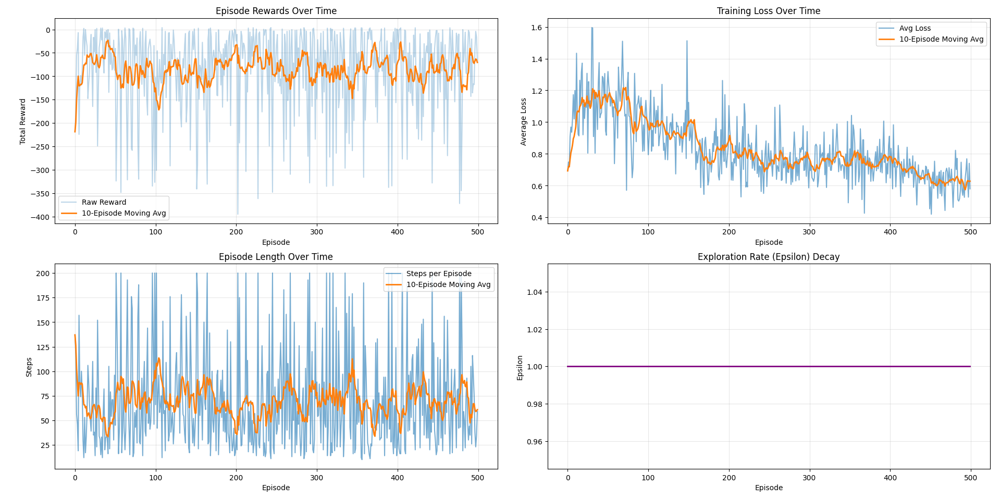

# DQN-CUDA: Deep Q-Network Implementation with CUDA

Una implementación completa de Deep Q-Network (DQN) acelerada con CUDA para aprendizaje por refuerzo de alto rendimiento.

## Características

* Aceleración GPU completa con CUDA
* Backpropagation completo con gradientes exactos en GPU
* Algoritmo DQN con experience replay y target network
* Optimizadores implementados en CUDA (SGD y Adam)
* Red neuronal configurable
* **Sistema de logging y visualización** con Python
* Ejemplos listos para usar

## Resultados de Entrenamiento



*Curvas de aprendizaje mostrando la evolución del reward, loss, pasos por episodio y epsilon decay durante el entrenamiento.*

## Requisitos

* NVIDIA GPU con capacidad de cómputo 3.5+
* CUDA Toolkit 11.0+
* cuBLAS
* g++ con C++17
* Make

## Compilación y Ejecución

### Compilar el proyecto principal

```bash
make
```

### Test del Optimizador

```bash
nvcc -o build/test_optimizer examples/test_optimizer.cu src/optimizer.cu -I./include -lcublas
./build/test_optimizer
```

### Test del Backward Pass

```bash
nvcc -o build/test_backward examples/test_backward.cu src/network.cu src/optimizer.cu -I./include -lcublas -std=c++17
./build/test_backward
```

### Test del DQN Completo

```bash
nvcc -o build/test_dqn examples/test_dqn.cu src/dqn.cu src/network.cu src/optimizer.cu src/replay_buffer.cpp -I./include -lcublas -std=c++17
./build/test_dqn
```

### Test del DQN con Logging y Visualización

```bash
# Compilar y ejecutar con logging
nvcc -o build/test_dqn_logging examples/test_dqn_with_logging.cu src/dqn.cu src/network.cu src/optimizer.cu src/replay_buffer.cpp src/training_logger.cpp -I./include -lcublas -std=c++17
./build/test_dqn_logging

# Visualizar resultados
pip install -r requirements.txt
python visualize_training.py training_log
```

### Script de Build Interactivo

```bash
./build.sh
# Selecciona la opción deseada del menú
```

## Estructura del Proyecto

```
dqn-cuda/
├── include/
│   ├── dqn.h
│   ├── network.h
│   ├── optimizer.h
│   ├── replay_buffer.h
│   ├── training_logger.h
│   └── cuda_utils.h
├── src/
│   ├── dqn.cu
│   ├── network.cu
│   ├── optimizer.cu
│   ├── replay_buffer.cpp
│   ├── training_logger.cpp
│   └── main.cu
├── kernels/
│   ├── activation_kernels.cu
│   ├── linear_kernels.cu
│   └── math_ops.cu
├── examples/
│   ├── test_optimizer.cu
│   ├── test_backward.cu
│   ├── test_dqn.cu
│   └── test_dqn_with_logging.cu
├── docs/
│   ├── dqn_implementation.md
│   ├── optimizer_implementation.md
│   ├── backward_pass_implementation.md
│   └── training_logging.md
├── visualize_training.py
├── requirements.txt
├── build.sh
└── Makefile
```

## Uso Básico

### Entrenamiento Simple

```cpp
#include "dqn.h"

DQN agent(state_dim, action_dim, 
          learning_rate, gamma, epsilon, epsilon_min, epsilon_decay,
          buffer_capacity, batch_size, target_update_freq);

for (int episode = 0; episode < 1000; episode++) {
    env.reset();
    while (!done) {
        int action = agent.select_action(state, true);
        auto [next_state, reward, done] = env.step(action);

        agent.store_experience(state, action, reward, next_state, done);
        agent.train_step();
    }
}
```

### Con Logging y Visualización

```cpp
#include "dqn.h"
#include "training_logger.h"

DQN agent(state_dim, action_dim, 
          learning_rate, gamma, epsilon, epsilon_min, epsilon_decay,
          buffer_capacity, batch_size, target_update_freq);
TrainingLogger logger("my_experiment");

for (int episode = 0; episode < 1000; episode++) {
    // ... entrenar episodio ...
    
    // Registrar métricas
    logger.log_episode(episode, total_reward, steps,
                      agent.get_epsilon(), agent.get_avg_loss());
}

// Visualizar con Python
// python visualize_training.py my_experiment
```

## Componentes Principales

### DQN Agent

* Exploración epsilon-greedy
* Replay buffer
* Target network
* Temporal Difference learning

### Neural Network

* Red feed-forward
* Backpropagation completo con gradientes exactos
* ReLU y derivada ReLU implementadas en CUDA
* cuBLAS para operaciones matriciales (gemv, ger, saxpy)

### Optimizer

* SGD con momentum
* Adam con bias correction
* Kernels CUDA personalizados

### Replay Buffer

* Memoria circular
* Muestreo aleatorio
* Evita olvido catastrófico

### Training Logger

* Logging de métricas por episodio
* Logging detallado por paso (opcional)
* Exportación a CSV
* Visualización con Python/Matplotlib

## Algoritmo DQN

1. Inicializar policy network y target network
2. Para cada episodio:
   - Seleccionar acción con epsilon-greedy
   - Ejecutar acción en el entorno
   - Guardar transición (s, a, r, s', done) en replay buffer
   - Muestrear batch aleatorio del buffer
   - Para cada transición en el batch:
     * Calcular TD target: y = r + γ * max Q'(s', a')
     * Forward pass: q = Q(s)
     * Calcular gradiente: ∇L = 2 * (q[a] - y) / batch_size
     * Backward pass: propagar gradientes
   - Actualizar pesos con optimizer
   - Actualizar target network periódicamente
   - Decrementar epsilon

Ver `docs/dqn_implementation.md` para detalles matemáticos completos.

## Hiperparámetros

```cpp
learning_rate = 0.001f
gamma = 0.99f
epsilon_start = 1.0f
epsilon_end = 0.01f
epsilon_decay = 0.995f
buffer_capacity = 10000
batch_size = 32
target_update_freq = 100
```

## Rendimiento

* Forward pass 10–100x más rápido que CPU
* Actualización de pesos paralelizada
* Operaciones matriciales optimizadas
* Sin transferencias innecesarias CPU-GPU

## Referencias
- [Playing Atari with Deep RL](https://arxiv.org/abs/1312.5602) (Mnih et al., 2013)
- [Human-level control through deep RL](https://www.nature.com/articles/nature14236) (Mnih et al., 2015)
- [Deep RL with Double Q-learning](https://arxiv.org/abs/1509.06461) (van Hasselt et al., 2015)

### Recursos
- [Sutton & Barto: RL Book](http://incompleteideas.net/book/the-book.html)
- [OpenAI Spinning Up](https://spinningup.openai.com/)
- [CUDA Programming Guide](https://docs.nvidia.com/cuda/)